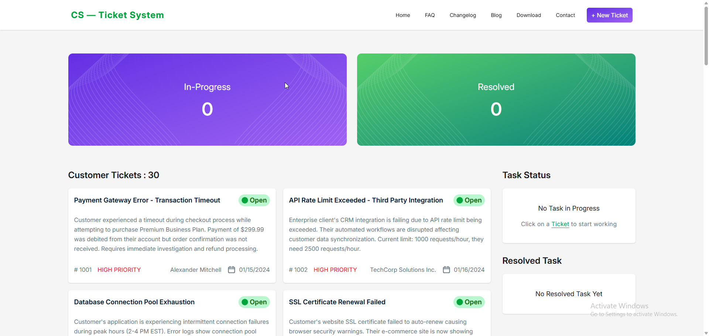

# 📌 Customer Support Zone | CS - Ticket System 

A professional **Customer Support Ticket System** built with **Vite + React**.  
Customers can create support tickets, track their ticket status, and get real-time updates.  
This project demonstrates dynamic data handling, modern UI, and professional development practices.

---

## 🚀 Features

- 🎫 Create, View, and Manage Support Tickets
- 📊 Track Ticket Status (Open, In Progress, Resolved)
- ⚡ Dynamic & Real-Time Ticket Handling
- 🎨 Beautiful UI with **TailwindCSS + DaisyUI**
- 🔔 Notifications using **React Toastify**
- 🔗 Icons powered by **React Icons**

---

## 🛠️ Tech Stack

- **Frontend Framework**: [Vite + React](https://vitejs.dev/)
- **Styling**: [Tailwind CSS](https://tailwindcss.com/) + [DaisyUI](https://daisyui.com/)
- **Notifications**: [React Toastify](https://fkhadra.github.io/react-toastify/)
- **Icons**: [React Icons](https://react-icons.github.io/react-icons/)

---

## 📂 Project Structure

- Add Later

---

## ⚙️ Installation & Setup

1. Clone the repository
   ```bash
   git clone https://github.com/aamamunszone/b12a07-customer-support-zone.git
   ```
2. Navigate to project folder
   ```bash
   cd b12a07-customer-support-zone
   ```
3. Install dependencies
   ```bash
   npm install
   ```
4. Run development server
   ```bash
   npm run dev
   ```

---

## 📸 Preview



---

## 👨‍💻 Author

Abdullah Al Mamun

GitHub: https://github.com/aamamunszone

Email: aamamunszone@gmail.com

---

## 📝 License

This project is licensed under the MIT License – free to use and modify.

---

## Answers to the Assignment Questions

1. What is JSX, and why is it used?  
   **Ans :** JSX stands for JavaScript XML. It allows us to write HTML-like syntax directly in JavaScript, making React code more readable and intuitive. React uses JSX to efficiently render components to the DOM.

1. What is the difference between State and Props?  
   **Ans :** State: Component-specific, mutable data that determines the component's behavior and rendering. Managed internally by the component.  
   Props: Immutable data passed from a parent component to a child component. Props cannot be modified by the child.

1. What is the useState hook, and how does it work?  
   **Ans :** `useState` is a React hook for managing state within functional components. It provides a state variable and a corresponding setter function :

   ```bash
   const [count, setCount] = useState(0);
   setCount(count + 1); // updates the state
   ```

1. How can you share state between components in React?  
   **Ans :** Lifting state up: Place the shared state in a common parent and pass it to children via props.

1. How is event handling done in React?  
   **Ans :** Events in React use camelCase naming and require function references rather than strings :
   ```bash
   <button onClick={handleClick}>Click Me</button>
   ```
